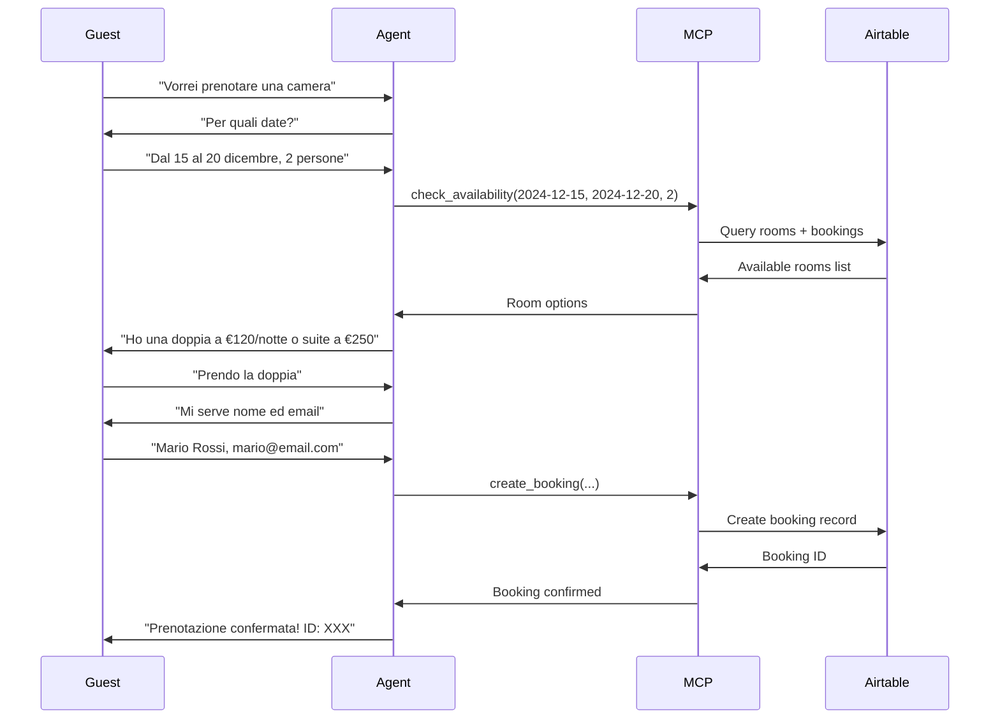
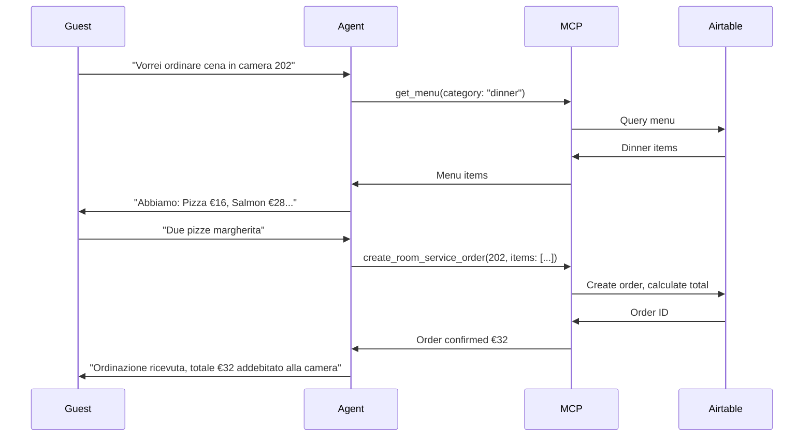
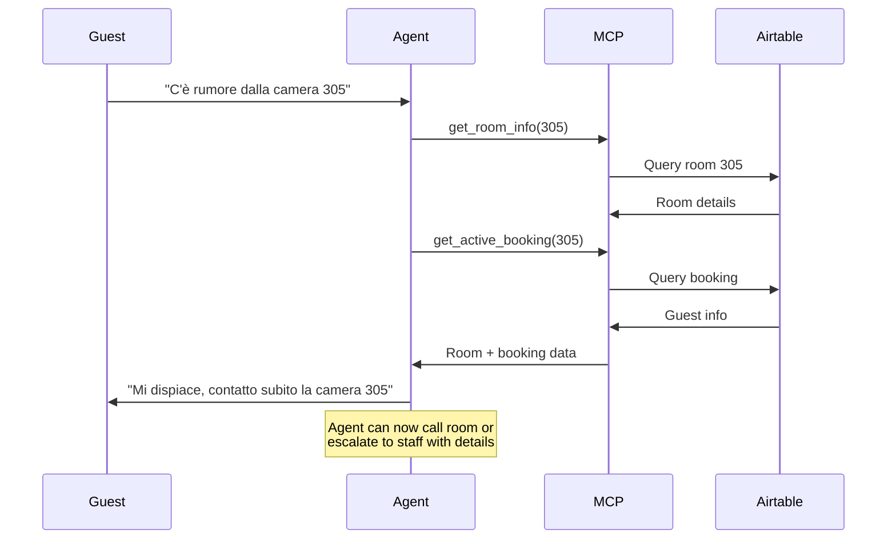

# Project Overview - MCP Hospitality Hub

## Cos'è questo progetto?

Un server MCP (Model Context Protocol) che permette a un AI Agent (come ElevenLabs) di gestire operazioni di receptionist per hotel in modo completamente automatizzato.

## Architettura

```
┌─────────────────────────────────────────────────────────┐
│                    ElevenLabs Agent                      │
│                   (Voice Interface)                      │
└────────────────────┬────────────────────────────────────┘
                     │ MCP Protocol (stdio/HTTP)
                     ▼
┌─────────────────────────────────────────────────────────┐
│              MCP Hospitality Hub Server                  │
│                  (This Project)                          │
│                                                          │
│  ┌──────────────────────────────────────────────────┐  │
│  │  Tools Layer                                      │  │
│  │  • check_availability                             │  │
│  │  • create_booking                                 │  │
│  │  • update_booking                                 │  │
│  │  • get_menu                                       │  │
│  │  • create_room_service_order                      │  │
│  │  • get_room_info                                  │  │
│  │  • get_active_booking                             │  │
│  └──────────────────────────────────────────────────┘  │
│                         ▼                                │
│  ┌──────────────────────────────────────────────────┐  │
│  │  Services Layer                                   │  │
│  │  • AirtableService (integrazione Airtable)       │  │
│  │  • (Futuro: NotionService, PaymentService, ...)  │  │
│  └──────────────────────────────────────────────────┘  │
└────────────────────┬────────────────────────────────────┘
                     │ Airtable API
                     ▼
┌─────────────────────────────────────────────────────────┐
│                    Airtable Base                         │
│  ┌──────────┬──────────┬──────────┬──────────────────┐ │
│  │  Rooms   │ Bookings │   Menu   │  Room Service    │ │
│  └──────────┴──────────┴──────────┴──────────────────┘ │
└─────────────────────────────────────────────────────────┘
```

## Stack Tecnologico

- **Runtime:** Node.js 18+
- **Linguaggio:** TypeScript (strict mode)
- **Protocol:** Model Context Protocol (MCP) via @modelcontextprotocol/sdk
- **Database:** Airtable (via SDK ufficiale)
- **Validazione:** Zod
- **Build:** TypeScript Compiler

## Struttura Directory

```
mcp-hospitality-hub/
├── src/
│   ├── config/              # Configurazione ambiente
│   │   └── index.ts         # Config loader e validator
│   ├── services/            # Business logic
│   │   └── airtable.ts      # Servizio Airtable
│   ├── tools/               # MCP tool definitions
│   │   └── index.ts         # Schema e definizioni tool
│   ├── types/               # TypeScript types
│   │   └── index.ts         # Types condivisi
│   └── index.ts             # Entry point MCP server
├── dist/                    # Compiled JavaScript
├── docs/
│   ├── README.md           # Documentazione principale
│   ├── QUICKSTART.md       # Setup rapido
│   ├── AIRTABLE_SETUP.md   # Configurazione Airtable
│   ├── DEVELOPMENT.md      # Guida sviluppo
│   └── DEPLOYMENT.md       # Guida deployment
├── .env.example            # Template configurazione
├── package.json
├── tsconfig.json
└── test-local.js           # Script test connessione
```

## Tool Disponibili

### 1. check_availability
**Scopo:** Verifica camere disponibili per date specifiche

**Input:**
- `checkIn`: Data check-in (ISO format)
- `checkOut`: Data check-out (ISO format)
- `guests` (opzionale): Numero ospiti
- `roomType` (opzionale): Tipo camera

**Output:** Lista camere disponibili con dettagli

**Esempio d'uso:**
```
Cliente: "Vorrei una camera dal 15 al 20 dicembre per 2 persone"
→ Agent usa check_availability
→ Presenta opzioni al cliente
```

### 2. create_booking
**Scopo:** Crea nuova prenotazione

**Input:**
- `roomId`: ID della camera
- `guestName`: Nome ospite
- `guestEmail` (opzionale)
- `guestPhone` (opzionale)
- `checkIn`, `checkOut`: Date
- `guests`: Numero ospiti
- `specialRequests` (opzionale)

**Output:** Conferma prenotazione con ID

### 3. update_booking
**Scopo:** Modifica prenotazione esistente

**Input:**
- `bookingId`: ID prenotazione
- Campi da aggiornare (date, ospiti, richieste)

**Output:** Prenotazione aggiornata

### 4. get_menu
**Scopo:** Ottieni menu ristorante/room service

**Input:**
- `category` (opzionale): breakfast, lunch, dinner, drinks

**Output:** Lista piatti con prezzi

### 5. create_room_service_order
**Scopo:** Ordina room service, addebita alla camera

**Input:**
- `roomNumber`: Numero camera
- `items`: Array di {menuItemId, quantity}
- `specialInstructions` (opzionale)

**Output:** Conferma ordine con totale

### 6. get_room_info
**Scopo:** Info dettagliate su camera specifica

**Input:**
- `roomNumber`: Numero camera

**Output:** Dettagli camera (tipo, prezzo, amenities, status)

**Caso d'uso:** Gestione reclami (es. rumore dalla camera X)

### 7. get_active_booking
**Scopo:** Trova prenotazione attiva per camera

**Input:**
- `roomNumber`: Numero camera

**Output:** Dati prenotazione attiva

## Flussi Principali

### Flusso 1: Nuova Prenotazione



### Flusso 2: Room Service



### Flusso 3: Reclamo Rumore



## Data Models

### Room
```typescript
{
  id: string;           // Airtable record ID
  number: string;       // "101", "202", etc.
  type: string;         // "single", "double", "suite"
  price: number;        // Prezzo per notte
  capacity: number;     // Numero ospiti max
  amenities: string[];  // ["WiFi", "TV", "Minibar"]
  status: 'available' | 'occupied' | 'maintenance';
}
```

### Booking
```typescript
{
  id: string;
  roomId: string;
  roomNumber: string;
  guestName: string;
  guestEmail?: string;
  guestPhone?: string;
  checkIn: string;      // ISO date
  checkOut: string;
  guests: number;
  totalPrice: number;
  status: 'confirmed' | 'checked-in' | 'checked-out' | 'cancelled';
  specialRequests?: string;
}
```

### MenuItem
```typescript
{
  id: string;
  name: string;
  description: string;
  category: string;     // "breakfast", "lunch", "dinner", "drinks"
  price: number;
  available: boolean;
  allergens?: string[];
}
```

## Sicurezza

- API keys mai committate (vedi .gitignore)
- Input validati con Zod
- Error handling robusto
- Environment-specific configs

## Performance

- Airtable rate limit: 5 req/sec
- Caching consigliato per menu (TTL 1h)
- Response time target: < 2s per tool call

## Testing

1. **Local test:** `node test-local.js`
2. **MCP Inspector:** `npm run inspector`
3. **Claude Desktop:** Integrazione per test conversazionali
4. **ElevenLabs:** Test finale con voice

## Roadmap Future

### Fase 2 (Prossimi Sprint)
- [ ] Caching layer (Redis optional)
- [ ] Logging strutturato (Winston)
- [ ] Metriche e monitoring
- [ ] Unit + integration tests

### Fase 3 (Scalabilità)
- [ ] Multi-tenancy (più hotel)
- [ ] Sistema di pagamenti
- [ ] Integrazione calendario (Google/Outlook)
- [ ] Notifiche push al personale

### Fase 4 (Advanced)
- [ ] Machine learning per prezzi dinamici
- [ ] Integrazione IoT (smart rooms)
- [ ] Analytics dashboard
- [ ] Mobile app per staff

## Costi Operativi

- **Airtable:** Free tier fino a 1,200 records/base (poi da $10/user/mese)
- **ElevenLabs:** Varia in base a minuti voce utilizzati
- **Hosting:** ~$5-20/mese per VPS basic (DigitalOcean, Linode)
- **Totale startup:** < $50/mese

## Supporto

- **Issues:** Apri una issue su GitHub
- **Docs:** Vedi README e guide linkate
- **Community:** [Link Discord/Slack se presente]

## Licenza

MIT - Libero per uso commerciale

## Contributors

Sviluppato per AI Receptionist use case con ElevenLabs Agent.

---

**Last Updated:** November 2024
**Version:** 1.0.0
**Status:** Production Ready ✅
